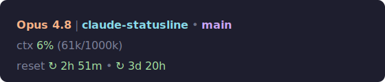

# claude-watch



A minimal Claude Code statusline showing model, folder, git branch, context window, and usage-limit resets. Themed with Catppuccin Mocha and portable across Linux and macOS.

## Installation

### Quick install

Downloads the scripts and merges the required `settings.json` blocks automatically (requires `curl` and `jq`):

```sh
curl -fsSL https://raw.githubusercontent.com/JoseVelazcoH/claude-statusline/main/install.sh | sh
```

Restart Claude Code to see the statusline.

### Manual install

**1. Clone the repo**

```sh
git clone https://github.com/JoseVelazcoH/claude-statusline.git
cd claude-statusline
```

**2. Copy the scripts**

```sh
cp fetch-usage.sh ~/.claude/fetch-usage.sh
cp statusline-command.sh ~/.claude/statusline-command.sh
chmod +x ~/.claude/fetch-usage.sh ~/.claude/statusline-command.sh
```

**3. Merge `settings.json` into `~/.claude/settings.json`**

Add the `statusLine` and `hooks` blocks from `settings.json` into your existing `~/.claude/settings.json`. If you don't have one yet, copy it directly:

```sh
cp settings.json ~/.claude/settings.json
```

**4. Trigger an initial fetch (optional)**

```sh
bash ~/.claude/fetch-usage.sh
```

## Themes

Four Catppuccin flavors are included: `mocha` (default), `macchiato`, `frappe`, and `latte`. Switch with:

```sh
~/.claude/statusline-theme.sh latte     # set a theme
~/.claude/statusline-theme.sh           # list themes and show the current one
```

The change applies on the next statusline render, no restart needed. Add your own palette by dropping a `themes/<name>.sh` file that sets the same color-role variables.

## How it works

- `statusline-command.sh` renders three lines: model/folder/branch, context window usage, and the limit-window reset countdowns. Usage values are colored by threshold (green below 50%, yellow 50 to 79%, red 80% or more).
- `fetch-usage.sh` reads the OAuth token (macOS Keychain or `~/.claude/.credentials.json` on Linux), caches it for 15 minutes, hits the `/oauth/usage` endpoint, and writes the results to a cache file. On failure the stale cache is preserved.
- `settings.json` wires up the statusline and refreshes usage in the background on the `PreToolUse` and `Stop` hooks.

## Dependencies

- `jq`
- `curl`
- `git` (optional, for branch display)
